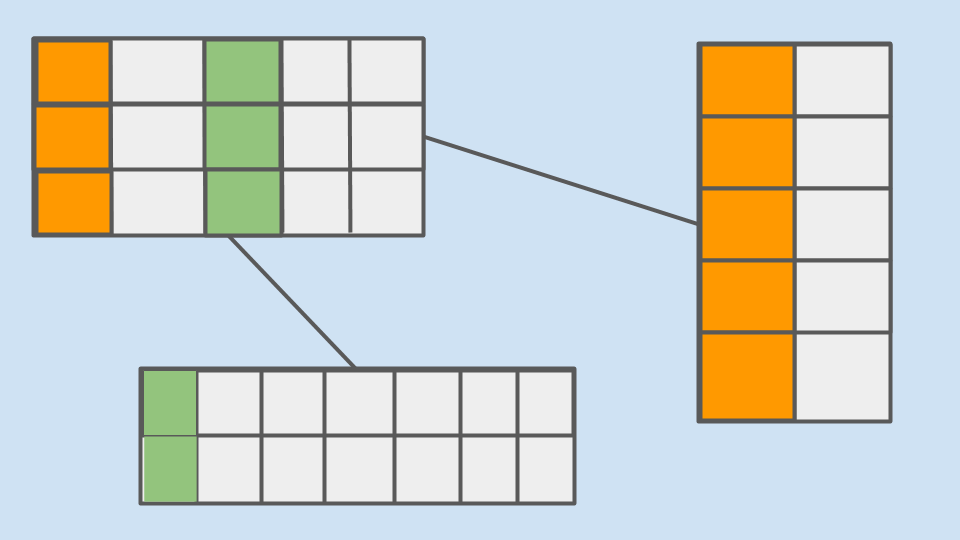
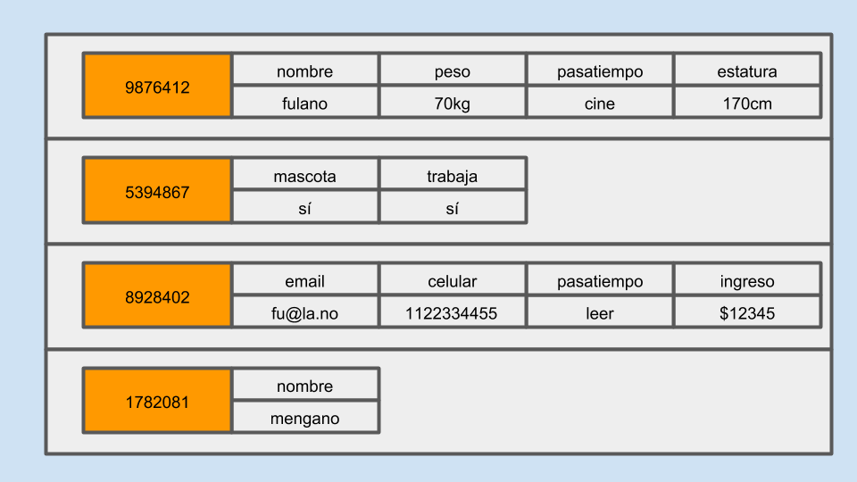
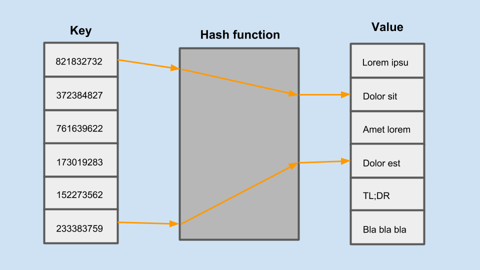
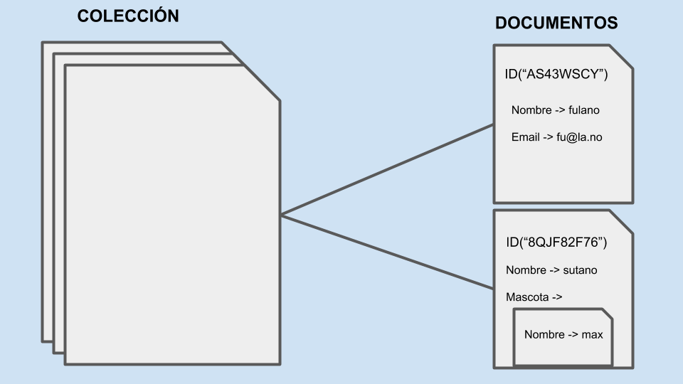
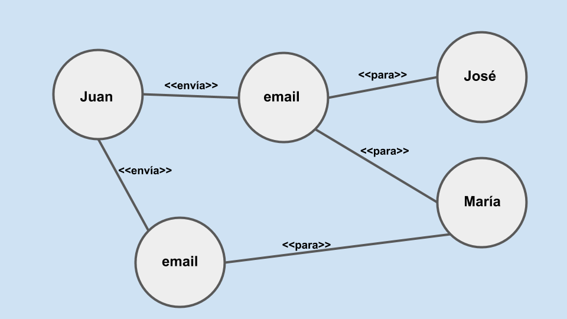

Si le preguntas a un experto en el tema de la cerveza te dirá que es un error pensar que solamente puedes elegir entre la clara y la obscura. Algo similar pasaría con un experto en vino si le dices que sólo existen el tinto y el blanco.

Pues en el camino a convertirte en un experto en bases de datos vas a descubrir que hay más de un tipo de bases de datos; de hecho, es un error muy común pensar que sólo existen las bases de datos relacionales y las no relacionales; o también se dice que hay bases de datos SQL y las no SQL.

Vamos directamente al listado de opciones que tenemos hoy en día:

 - Relacionales o SQL
 - Documentales
 - Key-value
 - Familia de columnas
 - Grafos

No está mal. Digo, no es una lista enorme. Ahora vamos a ver de forma general cada uno de los tipos que hay

## Bases de datos relacionales

Las bases de datos relacionales son las que tienen más tiempo sirviendo como la opción de cabecera. Hasta hace algunos años, de hecho, eran la única opción seria si querías desarrollar algo y no tener problemas al lanzar una aplicación muy grande.

### ¿Cómo guardan la información?

Este tipo de bases de datos almacena la información en forma de **tablas** que contienen **columnas** y **filas**. Las columnas representan los campos de información que cada registro debe tener y las filas representan los registros almacenados en cada tabla.

Cada tabla representa una entidad de nuestra aplicación, es decir, cada cosa de la que nos interesa guardar información.

Un detalle  muy característico de este tipo de bases de datos es que tienes que mezclar la información de las tablas mediante operaciones **JOIN** para poder componer de nuevo la información que existe entre dos o más tablas que almacenan información relacionada.

### ¿Cómo se diseñan los datos?

Para diseñar la estructura de datos de tu aplicación con una de estas bases de datos lo más importante es tener en mente el **principio de normalización**, que básicamente nos dice que:

> debemos mantener en una sóla tabla los datos de una sóla entidad.

Esto significa, por ejemplo, que si estamos almacenando datos de dueños de mascotas, necesitamos una tabla llamada mascotas que solamente guarda información de los animales registrados; por otro lado, necesitamos una tabla llamada dueños con la información de las personas que son dueñas de las mascotas.

Y aquí viene lo bueno ¿cómo sabemos quién es dueño de qué mascota? Y ¿cómo permitimos que la misma persona tenga registrado a más de un animalito?

Para eso usamos otra tabla que puede llamarse dueños_mascotas que almacene la relación que existe entre una persona en la tabla dueños y un animalito en la tabla mascotas.

Es una explicación muy simplificada y breve pero espero que ilustre el tema.

### Soluciones de este tipo

Aquí es donde probablemente tenemos las opciones con más tiempo en el mercado y cada una ofrece alguna ventaja o característica distintiva. Solamente por mencionar las más populares tenemos [PostgreSQL](https://www.postgresql.org/), [MySQL](), [MariaDB](https://mariadb.org/), [MSSQL Server](https://www.microsoft.com/en-us/sql-server/), [SQLite](https://www.sqlite.org/index.html)

## Bases de datos de familia de columnas

Estas bases de datos permiten consultas muy rápidas sobre colecciones de datos inmensas y generalmente son la opción a elegir cuando se almacenan datos de forma tabular con una estructura irregular en soluciones de big data.

### ¿Cómo guardan la información?

En estas bases de datos los registros se almacenan en tablas dispersas cuyas filas pueden contener una cantidad arbitraria de columnas y que están indexadas de forma natural por un dato que sirve como **key** para la fila, o sea, todas las filas deben tener un mismo dato que sirva para identificar cada registro.

### ¿Cómo se diseñan los datos?

Aquí debemos considerar que las columnas contienen piezas de información relacionada que pertenecen a cada fila.

Las columnas dentro de la fila pueden asociarse entre sí pero se mantienen agrupadas dentro de su fila correspondiente.

### Soluciones de este tipo

El ejemplo más popular de este tipo es tal vez [CassandraDB](http://cassandra.apache.org/) aunque no es la única. También podemos encontrarnos con otras como [HBase](https://hbase.apache.org/), [Druid](http://druid.io/technology) o [Bigtable](https://cloud.google.com/bigtable/).

 
## Bases de datos key-value

Este tipo de base de datos están basadas en la simplicidad y generalmente están orientadas a responder consultas tan rápido como sea posible al mismo tiempo que tratan de ser muy tolerantes a las fallas.

### ¿Cómo guardan la información?

Estas bases de datos se conforman por grandes estructuras de datos distribuidas llamadas **tablas hash** que almacenan y recuperan los valores organizados por identificadores llamados **keys**.

### ¿Cómo se diseñan los datos?

Toda la estrategia de diseño se basa en encontrar el dato que servirá como **key** para poder relacionar el resto de los datos de una entidad.

Los datos almacenados deben mantenerse en estructuras tan simples como sea posible tomando en cuenta que las entidades no se relacionan entre sí, a diferencia de lo que se hace al modelar bases de datos relacionales.

### Soluciones de este tipo

Por lo general estas bases de datos ofrecen una gran facilidad de funcionamiento y configuración con una gran resistencia a fallas y un manejo muy rápido de grandes colecciones de datos. Algunas soluciones de este tipo son [Redis](https://redis.io/), [DynamoDb](https://aws.amazon.com/es/dynamodb/) y [Memcached](https://memcached.org/) por mencionar unas pocas.

## Bases de datos documentales

Estas bases de datos pueden ser muy diferentes entre sí ya que el tipo de datos que almacena cada una puede ser muy diferente. Se están convirtiendo en el estándar alternativo a las bases de datos relacionales para guardar grandes cantidades de datos de una aplicación.

### ¿Cómo guardan la información?

Aquí cada base de datos toma un enfoque diferente pero de forma simple podemos decir que en estas bases de datos la información se almacena en forma de documentos como si usaramos un archivero.

Cada documento puede tener una estructura distinta entre sí y se pueden ordenar los datos de forma jerárquica prácticamente de la misma forma en la que organizamos los datos dentro de nuestros programas.

Algunas bases de datos almacenan la información en formato _XML_, otras usan _JSON_, etc. La forma más común de identificar los documentos es por medio de un campo de **ID**.

### ¿Cómo se diseñan los datos?

Aquí la estrategia para diseñar la base de datos consiste principalmente en identificar cómo se van a hacer las consultas de las entidades dentro de la aplicación. Si por ejemplo, en nuestra aplicación vamos a mostrar la información de facturas en una pantalla, lo más conveniente sería poner en cada documento la información completa de la factura junto con la información que necesitamos del cliente y de cada artículo vendido. Aquí se vale que los datos se repitan de forma redundante, ya que la idea detrás de la mayoría de estas bases de datos es que el almacenamiento suele ser más barato que el procesamiento.

### Soluciones de este tipo

Este tipo de bases de datos están gozando de mucha popularidad y hay muchas y muy buenas implementaciones con muy buen desempeño. Algunas opciones de este tipo son [MongoDB](https://www.mongodb.com/), [CouchDB](http://couchdb.apache.org/) o [Basex](http://basex.org/).

## Bases de datos de grafos.

Estas bases de datos se han vuelto cada vez más populares con la creciente demanda que hay de analizar grandes cantidades de datos. Permiten hacer consultas de información que simplemente no conviene o no se pueden resolver de forma práctica con la tecnología de bases de datos relacionales.

### ¿Cómo guardan la información?

Estas bases de datos almacenan la información en una estructura de datos llamada **grafo**, que consiste en encapsular los datos en **nodos** junto con las relaciones que tienen los nodos entre sí.

### ¿Cómo se diseñan los datos?

Cuando se trata de bases de datos de este tipo, lo que más importa es definir qué relaciones tienen los nodos entre sí e ir agregando más y más nodos y sus relaciones a medida que se van encontrando nuevas formas de relacionar los datos.

### Soluciones de este tipo

Existen varias bases de datos de este tipo con diferentes características a tomar en cuenta. Algunas de las más populares son: [Neo4J](https://neo4j.com/), [OrientDB](https://orientdb.com/) y [ArangoDB](https://www.arangodb.com/).

## Conclusión

Cómo puedes ver hay muchas tecnologías diferentes para resolver el problema de almacenar los datos de nuestra aplicación y no hay una respuesta inmediata a la pregunta ¿qué base de datos es mejor?. Hay que considerar las limitaciones y las ventajas que cada tipo de base de datos ofrece así como también las características que cada proveedor mantiene en sus productos. Pero eso será material para otro artículo.

Espero que esta información te sea útil y recuerda que puedes [subscribirte]({{ site.url }}/subscribirte) para no perderte de las actualizaciones del blog, y como siempre, puedes dejarme un saludo o decir lo que quieras a través de la página de [contacto]({{ site.url }}/contacto).

